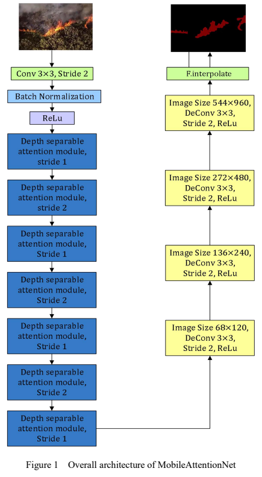
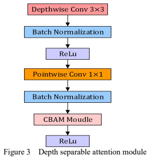
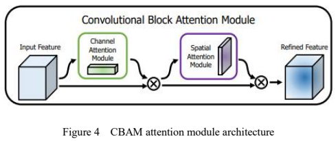
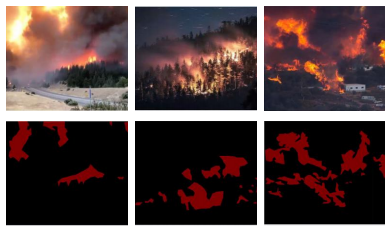
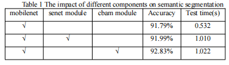

#### MobileAttentionNet
A deep convolutional neural network  for Semantic Segmentation of Forest Fire Images

Forest fire is one kind of natural disaster that is easy to occur in a dry climate, and applying deep learning to forest fire images can identify the fire area more accurately. In this paper, a semantic segmentation network, named MobileAttentionNet, is proposed to quickly detect forest fire areas, which uses MobileNet as a feature extraction network to achieve rapid and accurate extraction of image feature information. Besides, a Convolutional Block Attention module(CBAM) is also involved in this paper in the feature extraction structure, which allows the network to pay more attention to the feature information of the forest fire area while restraining the extraction of irrelevant features. Experimental results show that the proposed network achieves excellent segmentation performance in terms of efficiency and accuracy.
#### overall architecture of the MobileAttentionNet
The encoder part of architecture uses Seven deeply separable attention modules to realize the extraction of forest image feature information. The decoder part consists of four deconvolution modules with a stride of 2. In addition, Each deeply separable attention module adds a CBAM attention module to the last layer of the module. As a result, the deep neural network can focus on the feature information of the fire area.

|the overall architecture|the depth separable attention module|
|:---:|:---:|
|||

#### DataSet
Since the forest fire dataset has not yet been publicly available, 50 forest fire images have been obtained through the network and UAV shooting as the experimental data set of this article. As shown in Figure 6, this dataset is labeled by labeling the collected pictures, and it is divided into the training set and test set with a ratio of 4:1. The segmentation labels of the data set include background (label 0) and fire (label 1). This paper evaluates the effectiveness of the proposed feature extraction module through the experimental results of the model on the test set.

#### Experiment
This paper conducts experiments on different improvements of MobileAttentionNet. Where the first line is to use only Mobilenet as the feature extraction network to realize the semantic segmentation of the forest fire image fire area; the second line is the image semantic segmentation result with the senet attention module added to the Mobilenet feature extraction network; the third line is The experimental results of the cbam attention module are added to the Mobilenet feature extraction network. The experimental results show that the mobilenet feature extraction network with cbam attention module is more advantageous than the network without this part in the task of semantic segmentation of forest fire images. The Accuray coefficient can reach 92.83%, and the segmentation time for each image is only 1.022 seconds.

#### Operation details
step 1 -> python train.py

step 2 -> python test.py
